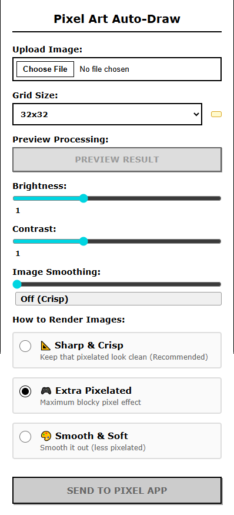

# (Insert Aperture jingle here because I'm not gonna embed a video here)

Hey all, Cave here, and I'm here to introduce you to our newest, biggest (shitpost) invention ever: Aperture Science Pixel Reproducer For E-Ink Devices. (not for E-Ink devices.)

  
Why?

  

 
And, most importantly, this was made thanks to all of our Aperture Science Personality Cores.
 

  
Which one?

  ## Yes. (good job robots)

Now, you might be wondering: "what the hell is this name?". Well, I named this thing after a test subject.

 
Look at him. (cue the aww sfx) Isn't he adorable? (for legal reasons we do not use him as our mascot.)
Alright, we're gonna stop yapping here now.

# So, how do we install this?
Well... this is for anyone with Chromium, as chromium is the fut- WHAT DO YOU MEAN PEOPLE WOULD RATHER RAISE FIREFOXES INSTEAD?
ok, so installation time:
1. Download the repo as a ZIP
2. Wait...
3. À̵̬̮̬̦̣͚Ǎ̴̡̬̤̩̤̮̆̓Á̸͙̈̎̍̆̏̎Ạ̴̖̟̗̎̊̑̑̔̈́̈́͘͝A̴̛̝̾̀̈́̄A̸͇͑̐̇̑̕̕̕A̴̫̣͂̀̾͌̚A̴̖̞͗̅̋̾̎̊̇̋̾A̶̝̼̤̜̞͉͎͙̅͛̉A̸͇̫̲̣̭͓̥͗A̴̤̣͒̿̅́͜͝Ȁ̵̡̘́̐̓͝Ầ̸̱͆̑͋̂̕͝Á̵̛̤̮̩̹̳̤̩̞̿̄̏͋̇̀͐A̴̙̥̲͉̪͊͑̇̋̌̈́̋̒̕Ä̴̛̬̹̔̀̕A̶͕͔͖̎͛̃̆̆͘͘ͅḀ̷̝̳̬̺̗́̅͆̋̽Á̶̠̘̞̪́̇̈́A̸̮̣̪̪̯̣͚̪̔Ȃ̷̳͙͓̩͇̂̎́͆̔̅̀̍Ạ̴̡̢̼̜͖̳͖͉̈́́͌̀A̷̯̱̓̿͠Ḁ̶̣̘̖̔A̵̗̠͌̾̊̏͋́͝͠͝À̶̢͉̳͔͉̻͕
4. Extract it.
5. Load up chrome://extensions
6. Load up the extracted folder as unpacked extensions
7. Profit.

# Use it.
  

That's it. Besides the "Image Rendering" thing that didn't work (we fired them), all should be working fine.
All good, ready to be relea-
# WHAT DO YOU MEAN I HAVE TO INCLUDE A LICENSE?
Public domain? That sounds good. Anything to make this thing release without complications.

(cue the aperture investment opportunity outro)

# NEW UPDATE!
Merged ~~Black Mesa's~~ @tockdev's code, so that no one has to ever look around to find a copy. It's right here.

# Further updates
Had to make this less confusing, with "Fact Core" helping with why the extension is slow. It's still slow as "Fact Core", during earlier helping sessions, decided to use more "advanced imaging setups" to make it look good, unlike tock's code (as mine has various image sizes while tock only made the userscript as a PoC)

## A Note On The "Crunchy" Image Rendering Issue

Remember when we said "Chromium is the future"? Well, about that. The future has decided that your pixel art renders with what we technical experts call a "delightful crunch." It's not a bug—it's Chrome's gift to you.

See, Chrome takes our nice `image-rendering` CSS property and treats it like a suggestion written on a napkin. "Oh, you want `crisp-edges`? How *adorable*. Let me just render this with my own proprietary anti-aliasing algorithm instead." No amount of CSS patches, canvas wrapping, or sacrificed test subjects will change Chrome's mind. It simply does not care about your pixel art dreams.

We've given up trying to fight the future. The crunchy rendering is now an official feature—a charming reminder that even in 2026, web browsers still can't agree on how to display 8-bit aesthetics.